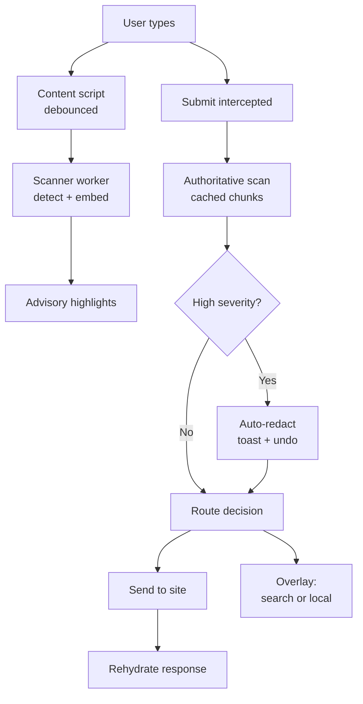

# Prompt Firewall — PRD / Spec

2026-09-19 · @Someone

## Summary

Prompt Firewall is a browser extension that sits between the user and any AI chat site and asks two questions before a prompt leaves the machine: does this need to go out at all, and what is it carrying?

The model is an ad blocker. It runs silently, does real work on every interaction, keeps a visible count of what it caught, and interrupts only when something genuinely matters. Nobody configures an ad blocker before browsing. Same bar here.

Three problems usually treated separately share one choke point, the moment a user hits Enter:

1. Data leakage. People paste client data, HR details, and source code containing API keys into consumer chatboxes daily. Enterprise no-training tiers reduce this risk but do not eliminate it: retention windows, breach exposure, legal holds, and shadow AI use on personal accounts all remain.
2. Wasted compute. A meaningful share of prompts are lookups a search engine answers better and far more cheaply. Per-prompt energy is small; the aggregate habit is not.
3. Cognitive offloading. Reaching for a frontier model on reflex, for questions the user could answer themselves, erodes the habit of thinking first.

A local scrubber redacts sensitive content reversibly before anything is sent. A local router suggests the cheapest lane that can do the job: search, cache, a small model, or the frontier model the user was already using. A usage dashboard makes the cumulative cost visible.

Everything that decides runs on the user's device. That is the core claim, and the differentiator from cloud DLP services, which are organization-deployed, route data through a third party, and block or log rather than redact reversibly.

## Design principles

These resolve every ambiguous product decision below.

1. Non-disruptive by default. The extension never prevents a user from sending what they want to send. Friction scales with severity, and the highest friction setting is a toast with an undo.
2. Routing suggests; privacy guards. A routing hint is dismissible and never blocks Enter. Only high-confidence, high-severity privacy findings alter the outgoing text.
3. Precision over recall at high friction. A false positive that interrupts the user teaches them to ignore the extension. Low-precision detectors (names, orgs) get highlights, never auto-redaction.
4. Nothing that decides leaves the device. The scrubber, router, and policy engine are local. A tool that ships prompts to a cloud API to check them for privacy is the leak.
5. Visible work, invisible process. A counter of what was caught, like an ad blocker's badge, is the whole ambient UI. No modals, no onboarding wizard.
6. Reversible, not destructive. Redaction uses placeholders that are restored locally in the response, so the user loses nothing by accepting it.
7. Honest claims. No inflated per-prompt energy figures, no claiming the tool guarantees privacy, no claiming detection is complete.

## Scope

| Component | Status | Notes |
| --- | --- | --- |
| Scrubber (regex, checksums, secrets) | Must demo | The reliable, high-precision layer |
| Scrubber (local NER for names, orgs) | Must demo | Highlight-only tier |
| Router (rules + local embedding classifier) | Must demo | Both layers, rules as fallback |
| Search lane with result cards | Must demo | Includes query rewriting and scrubbing |
| Usage dashboard and receipt | Must demo | Includes the tokenizer explainer |
| Local model lane (Gemini Nano) | Should | Degrades away on weak hardware |
| Small cloud model fallback | Should | Only on scrubbed text |
| Trusted-destination policy list | Should | Covers the org-AI counter-argument |
| Cache lane (semantic match on past prompts) | Stretch | Nearly free once the embedder exists |
| PDF and file attach scanning | Stretch | Text-based PDFs only if attempted |
| ANS destination verification | Stretch | Depends on what is in the registry |
| Classification-marking hard stop (CUI, export control) | Stretch | Cheap to build, strong demo beat |

Out of scope: network-level request interception (opaque and brittle), OCR for scanned PDFs, mobile, any server-side component holding user data, multi-user or admin policy management, and support for more than two chat sites.

The demo targets two chat sites. DOM interception breaks when sites change their composer markup, so breadth is a liability under time pressure.

## Architecture

A Manifest V3 extension with four parts:

- Content script, injected into supported chat sites. Owns composer observation, the submit gate, highlights, toasts, and the overlay panel that renders search results. Holds no models.
- Scanner worker, a Web Worker. Runs regex and checksum detectors, the NER model, and the embedder. Kept off the UI thread so typing never stutters.
- Service worker. Owns settings, the placeholder vault, the usage log, policy lists, and any outbound calls (search API, small cloud model, ANS lookups).
- Options and dashboard page. Settings, the usage receipt, and the tokenizer explainer.

The placeholder vault lives in the service worker in memory, keyed per tab, and is never persisted to disk. That way a crash loses a mapping rather than leaking one.

The send path always remains available. The overlay is an alternative the user can take, never a detour they are forced through.

## The scrubber

Three detector layers, each mapped to a severity tier that determines friction.

| Tier | Detectors | Precision | Default action |
| --- | --- | --- | --- |
| High | API keys and tokens, SSN, card numbers (Luhn), bank accounts, classification markings | High | Auto-redact, toast with undo |
| Medium | Email, phone, street address, date of birth | Medium-high | Auto-redact, listed in the toast |
| Low | Person, organization, and place names from NER | Lower | Highlight only, click to redact |

High and medium tiers are regex plus checksums plus custom patterns, which is why they are trusted enough to alter text. The low tier is a quantized NER model, and its recall is never complete, which is the reason it never acts on its own.

Placeholders are typed and consistent within a prompt: the first person found becomes PERSON\_1 and stays PERSON\_1 everywhere it appears. This preserves grammar and lets the model reason about who is who. The mapping lives in the vault, and the content script swaps real values back into the response after streaming completes.

The redaction diff is the core UI: original on one side, redacted on the other, with each change clickable to revert. It is also the single best demo moment.

Known limits to state plainly rather than paper over:

- NER recall is incomplete, so unusual names will be missed.
- Quasi-identifiers (role plus department plus dates) can re-identify someone with no detectable PII present.
- Placeholder redaction is reversible by design, so it protects against the recipient storing the data, not against an attacker on the device.

Stretch: PDF and file scanning runs at attach time rather than submit time, catching the file input, drag-and-drop, and paste events, extracting text with pdf.js in the worker. Redaction of a PDF must produce a new redacted text or file rather than drawing boxes over the original, since overlaid boxes leave the underlying text extractable.

## The router

Two layers. A rules layer runs first and handles the obvious cases by keyword and shape: question words plus a named entity, a URL, a definition request, a unit conversion. If the rules are confident, that is the answer. Otherwise the scrubbed prompt is embedded by a MiniLM-class model and classified by a logistic-regression head trained on a few hundred hand-labelled prompts.

Four labels:

| Label | Meaning | Destination |
| --- | --- | --- |
| searchable | A fact, lookup, current-events or how-to question | Search lane with result cards |
| cached | Semantically close to a prompt already answered | Prior answer, stretch |
| local-capable | Short rewrite, tone change, summarize, format | Local small model or small cloud |
| frontier | Multi-step reasoning, code, long context, creative work | Pass through to the site |

Rules that matter more than the model:

- Escalate on uncertainty, never downgrade. Below the confidence threshold, the prompt goes up a lane. The default lane is always the one the user chose by being on that site.
- The router never blocks Enter. Its output is a dismissible inline chip.
- A manual override is always one click, and overrides are logged as training signal for the classifier.
- The router must cost far less than it saves. An embedding pass plus a linear head is negligible against one frontier call, and this needs to be measured, not asserted.

Evaluation: hold out a labelled test set and report accuracy per label, the false-search rate (prompts sent to search that needed reasoning, the costly error), and median added latency. The false-search rate is the number that should appear on a slide, because it is the one a skeptical judge will ask about.

Prior art to cite rather than claim: LLM routing between strong and weak models is established work (RouteLLM among others). The novelty here is the search and cache lanes, the privacy stage in front, and running entirely client-side.

## Search lane

The prompt is rewritten into a short keyword query, scrubbed a second time, and sent to a search API. Search providers log queries, so the raw prompt never goes to them either. Rewriting is rules-based by default so it works on every machine, with the local model as an optional upgrade.

Results are presented as a ladder, defaulting to the least generated option:

1. Result list, the default. Three to five results with title, domain, and snippet, rendered in the overlay. Nothing is generated, so nothing can be hallucinated, and the user does the reading.
2. Extractive answer card. The top page is fetched, its passages are ranked against the query by the local embedder, and the best passage is shown verbatim with its source link. Still nothing generated.
3. Generated summary, opt-in behind a button. Local model where available, small cloud model otherwise.

Defaulting to a synthesized answer would recreate the habit the extension exists to interrupt, so the ladder starts at the bottom and the user climbs it deliberately.

Backend: Brave Search is the leading candidate, since it runs an independent index and is positioned for privacy-focused applications. Tavily and Serper are alternatives. Bing's Search API was retired in August 2025 and is not an option. Free-tier terms change, so confirm current limits before committing.

## Usage dashboard

The ambient surface is a badge count, exactly like an ad blocker: items redacted and prompts rerouted, this session. Clicking it opens the dashboard.

The dashboard shows, over a chosen window:

- Prompts intercepted, and the share that never reached a frontier model.
- Redactions by tier, with types but never the values themselves.
- Estimated tokens avoided, with an energy estimate shown as a range and labelled as an estimate.
- Lane distribution over time.

The receipt is a shareable summary card generated from that data, which doubles as the artifact for the Cloudforce track.

The tokenizer explainer sits alongside it: the user types, and the text visibly splits into tokens with a running count. It is the cheapest way to make the cost argument concrete, and it teaches something true about how these models work.

Honesty constraints: per-prompt energy figures are small, roughly a fraction of a watt-hour for a median text prompt by published vendor figures, so the display argues from the aggregate habit rather than dramatizing a single prompt. Ranges are shown rather than point estimates, and the methodology is one click away. A judge with a calculator should find the numbers conservative.

All usage data stays in local extension storage. There is no server, no account, and no sync. Prompt text is never stored, only metadata: lane, tier counts, token count, timestamp.

## Model strategy

| Job | Runs on | Why |
| --- | --- | --- |
| PII, secrets, classification markings | Local regex and small NER model | This is the privacy boundary; it cannot leave the device |
| Routing | Local embedder plus linear head | Fast, cheap, no LLM needed |
| Search query rewrite | Rules first, local model optional | Rules work on every machine |
| Short rewrite or summary | Gemini Nano where available, else small WebLLM or Ollama model | Private, no per-call cost |
| Same job, weak machine | Small cloud model on scrubbed text | Faster, and datacenters are likely more energy-efficient than a slow laptop |
| Hard reasoning, code | The site's own frontier model | The user is already there |

The deciding factor between local and small cloud is severity, not hardware. If the scan found high-severity content the user declined to redact, the job stays local or does not run. If everything sensitive was redacted, a small cloud call is acceptable. The policy is: local when privacy requires it, cloud when it is cheaper and safe.

Capability tiers, probed at install by checking RAM, WebGPU availability, and a short throughput test:

- Tier 0, any machine: scrubber, router, search lane, extractive answers, dashboard. No local LLM.
- Tier 1, typical laptop: adds a small local model for short rewrites and summaries.
- Tier 2, discrete GPU: larger local model, more prompts stay off the frontier lane.

On Tier 0 the local generation lane simply disappears. Those prompts go to search where possible, or through to the frontier model with scrubbing. Redaction still works everywhere, so the privacy guarantee does not depend on hardware.

Gemini Nano is the least work for the local lane since Chrome ships it with a Prompt API for extensions, but its published requirements are steep: desktop only, 22 GB free storage, and either more than 4 GB of VRAM or 16 GB of RAM with four or more cores. Recheck those before relying on them.

Trusted destinations. Some AI endpoints are already governed: an organization's own platform, for instance, may keep data inside its environment and exclude it from training. Those go on a trusted list, and the extension nudges sensitive prompts toward them instead of fighting them. Two exceptions still apply: classification markings (CUI, export-controlled) are blocked even to trusted destinations, and trust is a user-editable policy, not a judgment the extension makes silently.

If ANS verification is built, it checks identity only. It establishes that an endpoint is who it claims to be, not that it handles data well. The badge must say verified identity, never trusted with your data.

## Interaction spec

Scan continuously while typing, but never alter text or block anything until submit.

While typing. Scans are debounced on a pause of roughly 300 ms, and also fire on paste and at word boundaries. Results are advisory only, because mid-typing input is partial: an email is not an email until it is finished, and NER output flickers as a sentence changes. Findings appear as spellchecker-style underlines. Results are cached per text chunk so the submit scan is mostly incremental.

At submit. The content script listens for Enter in the capture phase, ahead of the site's own handler, and for clicks on the send button. It holds the event, runs the authoritative scan on the full text, and then:

- Clean: re-dispatches the event immediately with a flag to avoid re-entry. The user should not perceive a delay.
- High or medium severity found: auto-redacts, sends, and shows a toast naming what was replaced with an undo affordance. Undo restores the original text to the composer and does not resend.
- Low severity only: sends unchanged. Highlights remain visible for the user to act on if they choose.

Routing hints. After a typing pause, a small inline chip may appear near the composer suggesting a cheaper lane. Pressing Enter dismisses it and sends normally. The chip never intercepts the keystroke.

Responses. Placeholders are restored after streaming completes, or on hover, rather than mid-stream, to avoid rendering half-arrived tokens.

Modes. Watch logs findings without altering text. Autopilot is the default described above. Strict adds a confirmation step for high-severity findings and treats medium severity like high.

The budget: added latency at submit should stay well under 100 ms for a typical prompt, and typing must never stutter. Measure this on the slowest available machine early, because if it feels slow the ad-blocker premise fails regardless of how good the detection is.

Implementation note. Many chat composers are contenteditable rich-text editors, so setting value does not work. Text insertion goes through simulated paste or editing commands, and the approach must be verified per supported site.

## Metrics, build order and risks

Metrics worth putting on a slide:

- Share of test prompts that never needed a frontier model.
- False-search rate: prompts routed to search that actually needed reasoning.
- High-severity detection precision on a hand-built test set.
- Median added latency at submit.
- Items caught per hour of normal use, the ad-blocker number.

Build order, each stage independently demoable:

1. Content script plus submit gate on one site, with regex and secret detection and the toast. This alone is a working demo.
2. Redaction diff UI and the placeholder vault with rehydration.
3. Rules-based router and the badge counter.
4. Search lane with result cards.
5. Embedding classifier, trained on labelled prompts collected along the way.
6. Dashboard, receipt, and tokenizer explainer.
7. Stretch items, in the order listed in Scope.

Risks:

| Risk | Mitigation |
| --- | --- |
| Composer interception breaks on a site | Support two sites, test both the morning of judging, keep a recorded fallback |
| Model loading makes first use slow | Preload in the worker at page load; show a ready state on the badge |
| False positives annoy the demo audience | High-friction actions only on high-precision detectors |
| Judge challenges the energy numbers | Show ranges, cite the source, argue the aggregate not the prompt |
| Judge points to existing cloud DLP | Answer: local, individual, reversible, and it also decides whether to send at all |
| Local model unavailable on demo machine | Tier fallback is a feature, so demo it deliberately rather than hiding it |

Demo script, about three minutes: paste a support ticket containing a name, an email and an API key into a chat box and hit Enter. It sends, and a toast shows four items redacted. Open the diff and revert one. Then type a factual lookup and take the search card instead of the model. Then open the dashboard: prompts intercepted, items caught, share that never hit a frontier model. Close on the tokenizer explainer.

## Open questions

Resolve these with organizers and sponsors before building, since several change what gets built.

- [ ] Can one project be submitted to multiple tracks? This determines whether the scope above is one entry or several.
- [ ] Cloudforce: does the HokieAI Side Kick track require the submission to run on the HokieAI platform, or is a standalone piece plus a post sufficient? Is API access provided?
- [ ] Cloudforce: what does posting and showing a live post during judging mean concretely?
- [ ] Is HokieAI usage or metering data exposed programmatically? If so, the dashboard could read real numbers.
- [ ] GoDaddy ANS: what is actually in the registry, and does the API support identity lookup from a browser extension context? Extensions cannot query TXT or TLSA records natively, so this requires the ANS API or DNS-over-HTTPS.
- [ ] Search API: current free-tier limits and terms for the chosen provider.
- [ ] Which two chat sites to support, based on what the team uses and what the judges will recognize.
- [ ] Scrubber and router latency on the slowest machine on the team.

Track fit, to revisit once the above are answered: Cloudforce is the receipt and tokenizer piece; GoDaddy ANS depends on registry contents; Peraton fits through the local-only lane and the classification-marking stop, though loosely. Deloitte and Databricks is dropped, since the project is no longer student-specific.
